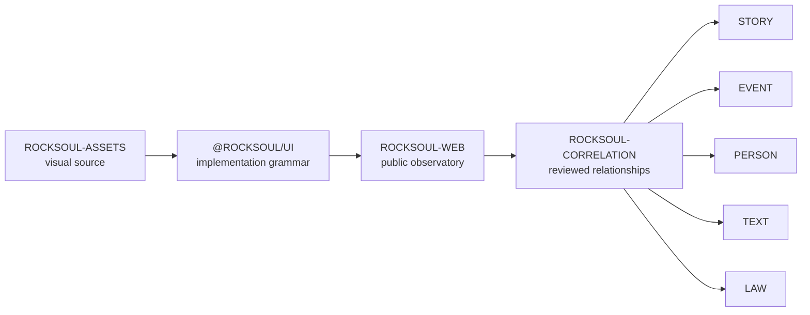

<div align="center">


# ROCKSOUL WEB

## **THE PUBLIC OBSERVATORY**

### **WHERE MYTH FADES TO LEGEND**

Public-facing application for the **MoonWitness × Rocksoul** ecosystem: cinematic landing, archive contact sheet, reviewed cases, research method, explainable correlation, provenance, and source freshness.


[Design Source](https://github.com/bjo163/rocksoul-assets) · [UI System](https://github.com/bjo163/rocksoul-ui) · [Community](https://github.com/bjo163/rocksoul-community) · [Console](https://github.com/bjo163/rocksoul-crayon)

</div>

---

> **ROCKSOUL WEB presents the ecosystem. It does not become canonical ownership for research data.**

## Canonical chain



## Current public experience

The landing experience is intentionally different from the authenticated application shell.

```text
PUBLIC / CINEMATIC
├── MoonWitness archive header
├── WHERE MYTH FADES TO LEGEND hero
├── @rocksoul/ui CinematicWebHero
│   ├── responsive photographic desktop/mobile masters
│   ├── Rocksoul — the witness in motion
│   ├── STORY / PERSON / EVENT / RGBL relationship map
│   └── archive contact sheet
├── research manifesto
└── live correlation workbench
    ├── reviewed case search
    ├── canonical source freshness
    ├── evidence / counterevidence / alternatives
    └── canonical-owner provenance

AUTHENTICATED / UTILITARIAN
└── @rocksoul/ui ApplicationShell
```

The public hero is **owned by `@rocksoul/ui`** and consumed here as `CinematicWebHero`. `rocksoul-web` no longer maintains a parallel hero renderer or asset loader.

## Cinematic hero delivery handshake

```text
rocksoul-assets/main
└── moonwitness/cinematic-web-hero/manifest.json
              ↓
@rocksoul/ui
└── CinematicWebHero
              ↓
rocksoul-web
└── consumer composition only
```

The asset repository owns cinematic masters, grid, grain, scanlines, and contact-sheet sources. The UI package owns responsive composition, evidence semantics, archive presentation, accessibility, and reduced-motion behavior. The web application only supplies public navigation targets and the theme control.

Headline, CTA, evidence graph, coordinates, labels, and correlation/causation language remain live HTML/SVG rather than baked into a screenshot.

## Public correlation fallback

Production prefers `VITE_CORRELATION_API_URL` or the same-origin correlation API. When that runtime is unavailable, the public web now falls back conservatively to the reviewed corpus on `rocksoul-correlation/main`.

- reviewed cases remain browsable;
- graph edges retain support, counterevidence, alternatives, confidence and epistemic status;
- provenance still links to canonical owner repositories;
- live owner-head freshness is **not fabricated**: the fallback explicitly reports those checks as unavailable until the runtime API is connected.

## Visual contract

- MoonWitness is the product umbrella.
- Rocksoul is the connective character/thread.
- The public surface uses cinematic editorial composition; authenticated surfaces use the shared application shell.
- Dark near-black + warm paper remain the dominant modes.
- Crimson is a signal/boundary accent, not generic decoration.
- Mono metadata, hairline grids, coordinates, archive labels, evidence nodes, and contact-sheet framing are first-class visual grammar.
- Status must never depend on color alone.
- Correlation must always carry explanation.
- Graph views require a text equivalent.
- Legal analysis must never present itself as a court judgment.
- Motion must respect `prefers-reduced-motion`.

## Canonical public surfaces

The broader visual contract still maps to `rocksoul-assets` screens **01–12**:

```text
LANDING
MANIFESTO
ROCKSOUL CHARACTER
REPOSITORIES OVERVIEW
STORY
EVENT
PERSON
TEXT / RGBL
LAW / AWS
PUBLIC CASE
CORRELATION
LEGAL ANALYSIS
```

## Runtime configuration

The correlation API can be pointed at a deployed service with:

```bash
VITE_CORRELATION_API_URL=https://your-correlation-host
```

Without an override, requests stay same-origin.

## Develop

```bash
npm install
npm run dev
npm run ci
```

Node **22+** is required.

## Branch contract

```text
dev  ── verified promotion ──> main
```

- `dev` — active implementation and integration.
- `main` — stable/release baseline.
- CI verifies typecheck + production build before promotion.

---

<div align="center">

## **REAL STORIES · PERSISTENT TRACES · A WIDER TOMORROW**

### **STORY · EVENT · PERSON · TEXT · LAW**

`WEB / MoonWitness × Rocksoul`

</div>
