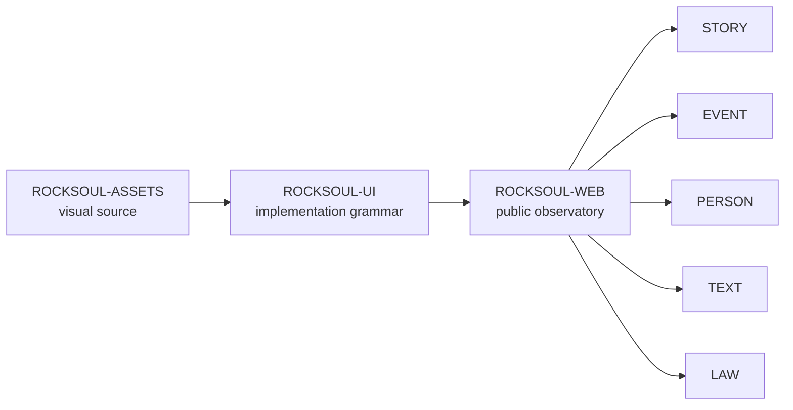

<div align="center">


# ROCKSOUL WEB

## **THE PUBLIC OBSERVATORY**

### **EXPLORE THE RECORD. FOLLOW THE EVIDENCE.**

Public-facing application for the **MoonWitness × Rocksoul** ecosystem: landing, observatory, repositories, cases, correlation, and explainable legal/research views.


[Design Source](https://github.com/bjo163/rocksoul-assets) · [UI System](https://github.com/bjo163/rocksoul-ui) · [Community](https://github.com/bjo163/rocksoul-community) · [Console](https://github.com/bjo163/rocksoul-crayon)

</div>

---

> **ROCKSOUL WEB presents the ecosystem. It does not become canonical ownership for research data.**

## Product role



## Canonical public surfaces

The visual contract comes from `rocksoul-assets` screens **01–12**:

```text
LANDING
MANIFESTO
ROCKSOUL CHARACTER
REPOSITORIES OVERVIEW
STORY
EVENT
PERSON
TEXT / RGBL
LAW / AWS
PUBLIC CASE
CORRELATION
LEGAL ANALYSIS
```

<div align="center">


</div>

## Ecosystem map

| Layer | Repository | Responsibility |
|---|---|---|
| DESIGN | [`rocksoul-assets`](https://github.com/bjo163/rocksoul-assets) | canonical brand, tokens, screens, motion, data-viz |
| UI | [`rocksoul-ui`](https://github.com/bjo163/rocksoul-ui) | reusable production UI system |
| WEB | **`rocksoul-web`** | public observatory and explainable browsing |
| COMMUNITY | [`rocksoul-community`](https://github.com/bjo163/rocksoul-community) | participation, identity, discussion |
| PLATFORM | [`rocksoul-platform`](https://github.com/bjo163/rocksoul-platform) | administration and product operations |
| CONSOLE | [`rocksoul-crayon`](https://github.com/bjo163/rocksoul-crayon) | research/operator workspace |

Research domains remain canonical in `rocksoul-mftl`, `rocksoul-legend`, `rocksoul-superhero`, `rocksoul-rgbl`, and `rocksoul-aws`.

## Visual contract

- MoonWitness is the product umbrella.
- Rocksoul is the connective character/thread.
- Use `@rocksoul/ui`; do not fork shared application grammar locally.
- Use canonical assets from `rocksoul-assets`.
- Public/community surfaces may be expressive and cinematic; evidence and status must remain readable.
- Correlation must always carry explanation.
- Graph views require a text equivalent.
- Legal analysis must never present itself as a court judgment.

---

<div align="center">

## **WHERE MYTH FADES TO LEGEND**

### **STORY · EVENT · PERSON · TEXT · LAW**

`WEB / MoonWitness × Rocksoul`

</div>
